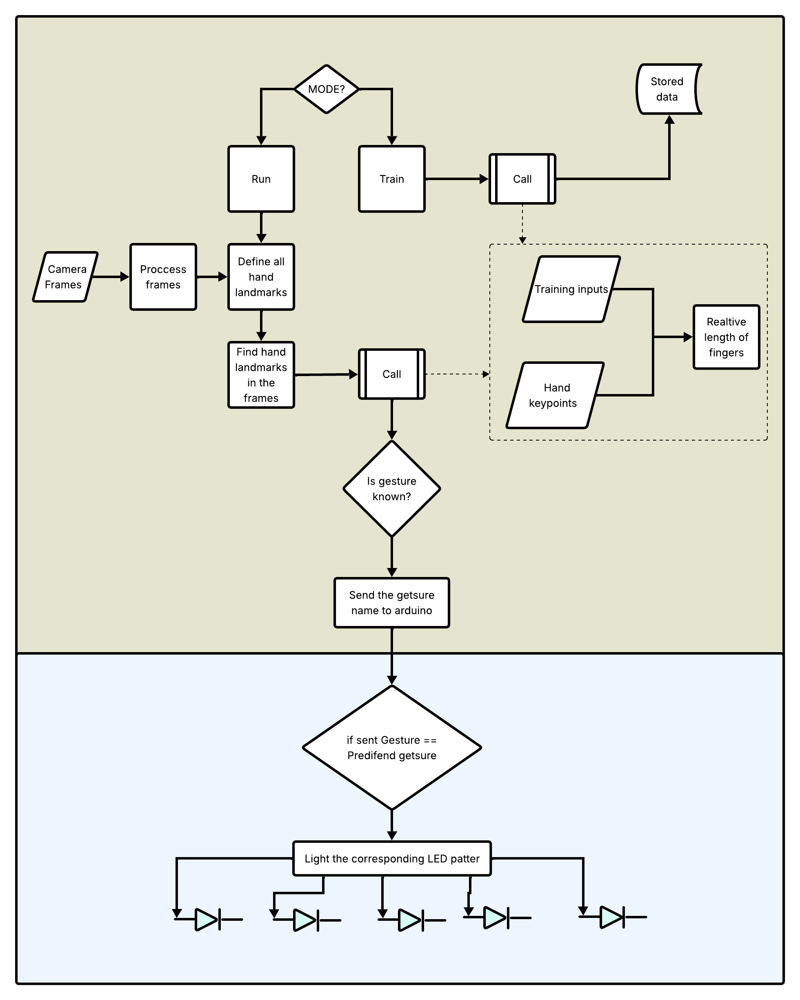
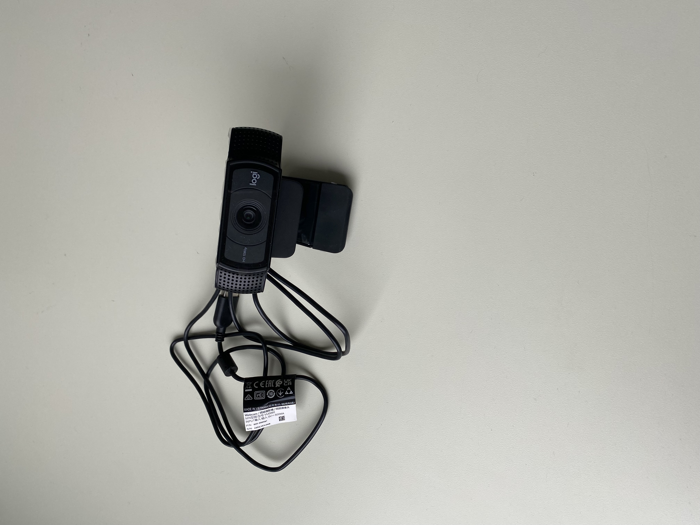

# Avicenna Hand
# Goal
The goal of Avicenna Hand project is to detect gestures from human hand-fingers  to switch on and of a corresponding<b>
pattern of LEDs. This proves that the camera could be integrated to the Octobus-SmartCar.<b>

# How does it works
Computer Vsion-Labtop side:<b>
-The algorithm detects a hand getsure in a frame captured by the camera<b>
- The user can to train a ceratin hand gesture that will be saved with other gestures <b>
- or chooese to run(test) a gesture by showing up some fingers<b>
- The algorithm compares the gesture appears to the stored ones<b>
- If the gesture is known, it will be sent to arduino<b>
Arduino side:<b>
-Compare the entering message to stored ones<b>
-Light up the LEDs accordingly<b>

# Algorithm flowchart

# Hand gestures detected

# Used camera

-C920 Pro HD WEBCAM

# Demonstartion
https://github.com/user-attachments/assets/7bd12186-04da-4706-9c22-52288e71a9ce
# Budget

| Components  | Qt | Price(Euro)| 
| ---------   |----|--------    |
| Camera      | 1  | 71,95      |
| Arduino     | 1  | 24,4       |  
| LEDS        | 5  | 00.5       |   
| Connectors  | -  | 01.0       |   
| Total       | -  | 97,85      |
# Technologies used
-OpenCv(cv2)<b>
-MediaPipe<b>

